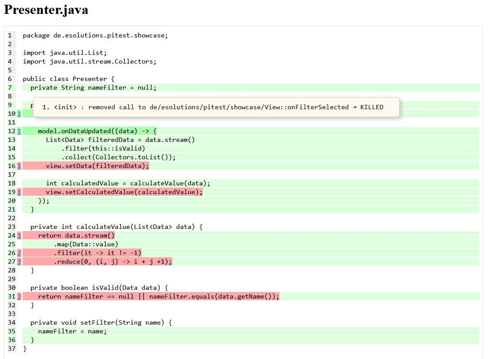

# Simple Pitest Gradle Sample

This project showcases mutation testing using [Pitest](https://pitest.org/) based on a very simple dummy Gradle/Java 
project.

## Prerequisites

* Git
* Java 17

## Build the Pitest report

* Clone the repository: `git clone https://github.com/e-solutions-GmbH/pitest-gradle-sample.git`
* Run `./gradlew pitest` in project root
* Open the report: `build/reports/pitest/index.html`